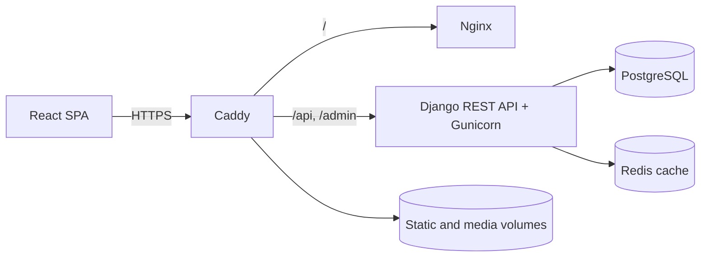

# EidosAcademy

[](https://github.com/Middlewarer/EidosAcademy/actions/workflows/ci.yml)
[](https://www.python.org/)
[](https://www.djangoproject.com/)
[](https://react.dev/)

**EidosAcademy** — полнофункциональная образовательная платформа с курсами по программированию. Пользователь может записаться на курс, изучать материалы по темам, отмечать их завершёнными и продолжать обучение с последнего посещённого места.

**Работающий проект:** [eidosacademy.ru](https://eidosacademy.ru)<br>
**Статус:** развёрнутый MVP, который продолжает развиваться.

## Возможности

- каталог опубликованных курсов с поиском и фильтрацией;
- программа курса с модулями, темами и Markdown-материалами;
- запись на курс и сохранение последнего открытого материала;
- статусы тем, модулей и курса, рассчитанные по реальному прогрессу;
- JWT-аутентификация с ротацией и отзывом refresh-токенов;
- синхронизация сессии между вкладками и единичный refresh при параллельных `401`;
- профиль пользователя, смена данных и безопасная смена пароля;
- публичная доска отзывов, пожеланий и сообщений об ошибках с модерацией;
- загрузка аватаров и обложек курсов через Django `ImageField`;
- светлая и тёмная темы, адаптивная навигация;
- Django Admin для управления учебным контентом.

## Архитектура



Production-окружение поднимается одним Compose-проектом. Caddy завершает TLS и маршрутизирует запросы, Nginx отдаёт собранный React, Gunicorn запускает Django API. PostgreSQL и Redis доступны только во внутренней Docker-сети.

## Технологии

| Область | Стек |
| --- | --- |
| Backend | Python 3.13, Django 6, Django REST Framework |
| Auth | Simple JWT, token rotation, blacklist |
| Data | PostgreSQL 17, Redis 7, Django ORM |
| Frontend | React 19, React Router, Vite 7 |
| Content | react-markdown, remark-gfm, Pillow |
| Production | Docker Compose, Gunicorn, Nginx, Caddy, HTTPS |
| Tests | Django TestCase, DRF APIClient, Node.js Test Runner |

## Технические решения

**Надёжное обновление JWT.** Все защищённые запросы проходят через единый API-клиент. При истечении access-токена клиент обновляет пару токенов и повторяет исходный запрос. Параллельные запросы и несколько вкладок разделяют одну операцию refresh, поэтому ротация токена не разрушает активную сессию.

**Целостный прогресс обучения.** Запись на курс идемпотентна. Посещение темы сохраняет последнюю позицию отдельно от завершения, а состояние модуля и курса вычисляется по дочерним темам.

**Безопасность прикладного уровня.** Пароли проверяются валидаторами Django и хранятся только в виде стойких хешей. После смены пароля ранее выданные JWT отклоняются. Для входа, регистрации, refresh, смены пароля и отправки отзывов настроены ограничения частоты запросов через общий Redis-кеш.

**Воспроизводимое развёртывание.** Compose применяет миграции, собирает static, проверяет готовность PostgreSQL и Redis и запускает сервисы в правильном порядке. Данные БД, медиафайлы и TLS-сертификаты сохраняются в именованных volumes.

## API

| Метод и маршрут | Назначение | Доступ |
| --- | --- | --- |
| `GET /api/courses/` | Каталог опубликованных курсов | публичный |
| `GET /api/courses/{id}/` | Курс, программа и прогресс | публичный / расширенный для пользователя |
| `POST /api/register/` | Регистрация | публичный |
| `POST /api/token/` | Получение пары JWT | публичный |
| `POST /api/token/refresh/` | Ротация JWT | публичный |
| `POST /api/logout/` | Отзыв refresh-токена | авторизованный |
| `GET /api/me/` | Профиль текущего пользователя | авторизованный |
| `PATCH /api/me/` | Изменение профиля | авторизованный |
| `POST /api/me/password/` | Смена пароля | авторизованный |
| `POST /api/assign/` | Запись на курс | авторизованный |
| `POST /api/progress/visit/` | Сохранение текущей темы | авторизованный |
| `POST /api/progress/complete/` | Завершение темы | авторизованный |
| `GET, POST /api/feedback/` | Публичная лента и отправка обращения | публичный |

## Быстрый запуск через Docker

Потребуются Git, Docker Engine и Docker Compose.

```bash
git clone https://github.com/Middlewarer/EidosAcademy.git
cd EidosAcademy
cp .env.production.example .env.production
```

Замените значения `SECRET_KEY`, `DB_PASSWORD` и домены в `.env.production`, затем запустите приложение:

```bash
docker compose --env-file .env.production up --build -d
docker compose --env-file .env.production exec backend python manage.py createsuperuser
```

Проверить состояние и журналы:

```bash
docker compose --env-file .env.production ps
docker compose --env-file .env.production logs -f backend caddy
```

Для локальной проверки через `http://localhost` используйте небезопасные cookie и отключённый HTTPS-редирект, как описано комментариями в `.env.production.example`.

## Запуск для разработки

Потребуются Python 3.12+, Node.js 22.12+, PostgreSQL и Redis.

### Backend

```bash
python -m venv venv
# Windows PowerShell: .\venv\Scripts\Activate.ps1
# Linux/macOS: source venv/bin/activate
python -m pip install -r requirements.txt
```

Скопируйте `.env.example` в `.env`, заполните параметры PostgreSQL и выполните:

```bash
python manage.py migrate
python manage.py createsuperuser
python manage.py runserver
```

Backend будет доступен на `http://127.0.0.1:8000`, админ-панель — на `/admin/`, healthcheck — на `/health/`.

### Frontend

```bash
cd frontend
cp .env.example .env
npm ci
npm run dev
```

Frontend будет доступен на `http://127.0.0.1:5173`. Значение `VITE_API_URL` должно содержать адрес backend без `/api` и завершающего `/`.

## Тестирование

Backend-набор проверяет авторизацию, ротацию и отзыв JWT, смену пароля, throttling, запись на курс, прогресс, права доступа и публикацию отзывов. Frontend-набор проверяет критические сценарии обновления сессии, включая параллельные запросы и несколько вкладок.

```bash
python manage.py test courses.tests --noinput
npm --prefix frontend test
npm --prefix frontend run lint
npm --prefix frontend run build
```

Эти же проверки автоматически выполняются в GitHub Actions при каждом push и pull request.

## Структура проекта

```text
EidosAcademy/
├── backend/             # Настройки Django, маршрутизация, healthcheck
├── courses/             # Модели, API, auth, permissions, throttling, тесты
├── frontend/            # React-приложение и клиентские тесты
├── deployment/          # Сценарии обслуживания Windows-хоста
├── compose.yaml         # Production-сервисы и постоянные volumes
├── Caddyfile            # HTTPS и reverse proxy
└── requirements.txt     # Зафиксированные Python-зависимости
```

## Ближайшие задачи

- интерактивные задания с вариантами ответа и проверкой результата;
- расширение учебного контента и административного процесса публикации;
- метрики продукта и наблюдаемость production-среды;
- дополнительные интеграционные и браузерные тесты.

## Автор

Проект разработан [Middlewarer](https://github.com/Middlewarer) как самостоятельный продукт и портфолио Python backend-разработчика.
